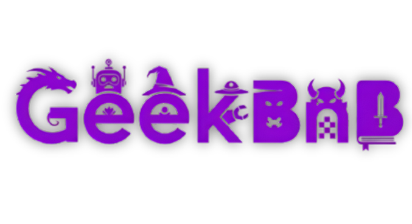

# GeekBnB

**GeekBnB** é um projeto de estudo inspirado no Airbnb, focado no aluguel de casas de mundos de desenhos, filmes e séries. Desenvolvido com **MongoDB, Express, React, Node.js** e **TypeScript**, explora funcionalidades web modernas e boas práticas de programação. O projeto ainda está em desenvolvimento.

## Tecnologias

- **Frontend:** React + TypeScript  
- **Backend:** Node.js + Express + TypeScript  
- **Banco de dados:** MongoDB  
- **Estilo:** Tailwind CSS (opcional, se estiver usando)

## Funcionalidades

- Cadastro e autenticação de usuários  
- Listagem de propriedades fictícias  
- Busca por localização e datas  
- Visualização de detalhes das casas  
- Interface moderna e responsiva  

> ⚠️ Em desenvolvimento – algumas funcionalidades podem não estar implementadas.
